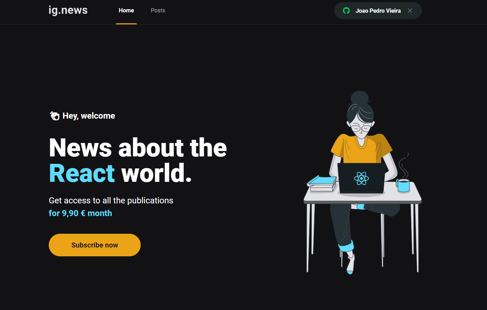

<h1 align="center">IGNEWS

<p align="center">
  

  

  
  <a href="https://github.com/DevJPVR/ShoppingCart/commits/master">
    
  </a>
    
   
   <a href="https://github.com/DevJPVR/jpnews/blob/main/LICENSE">


  <a href="#">
    
  </a>
  

 
</p>


<h1 align="center">
    
</h1>


<br>

## 🧪 Tecnologias

Esse projeto foi desenvolvido com as seguintes tecnologias:

- [NextJS](https://nextjs.org)
- [TypeScript](https://www.typescriptlang.org/)
- [FaunaDB](https://fauna.com/)
- [Prismic](https://prismic.io/)
- [Stripe](https://stripe.com/pt-br-pt)

## 🚀 Como executar

Clone o projeto e acesse a pasta do mesmo.

```bash
$ git clone https://github.com/DevJPVR/jpnews.git
```

Para iniciá-lo, siga os passos abaixo:
```bash
# Instalar as dependências
$ yarn
# Iniciar o projeto
$ yarn start
```
O app estará disponível no seu browser pelo endereço http://localhost:3000.


## 💻 Projeto

Portal desenvolvido para apaixonados por tecnologia e que desejam sempre estar atualizado com o mercado. Através de uma assinatura mensal, o usuario consegue ter acesso a conteudos exclusivos na plataforma,
fazendo login com o github.


## 💻 Informações tecnicas

Aplicação desenvolvida com NextJS, faunaDB para armazenar os dados dos usuarios e as subscriptions, stripe para controlar o plano de assinatura, criação do produto e metodo de pagamento,
Prismic para postagem de conteudo na plataforma, Webhooks para monitoramento de eventos do usuario durante o pagamento do plano. Todas as ferramentas se conectam de forma dinamica, trazendo uma melhor experiencia para o usuario final.

Vale lembrar que esta aplicação foi desenvolvida durante o curso que estou fazendo na RocketSeat


## 📝 License

Esse projeto está sob a licença MIT. Veja o arquivo [LICENSE](https://github.com/DevJPVR/jpnews/blob/main/LICENSE) para mais detalhes.

---

Feito com 💜 by JoãoPedro
